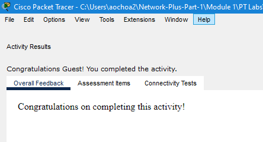
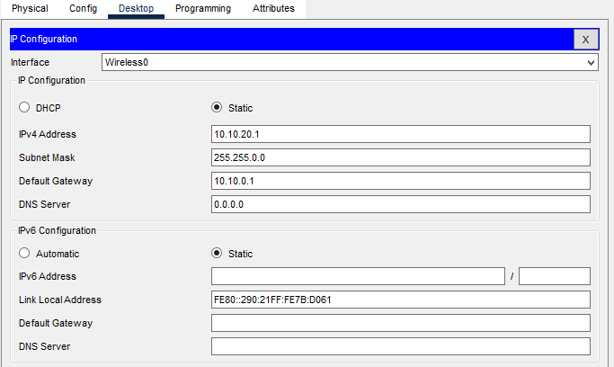
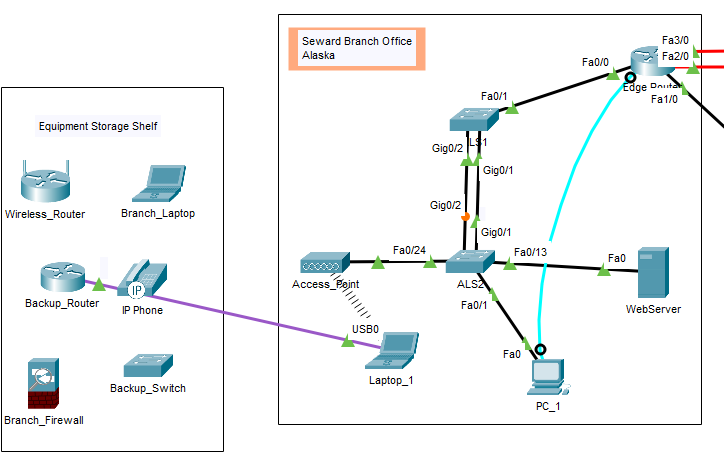

# Packet Tracer Lab Template

## Lab Title
Logical and Physical mode Exploration

=======
## Student Name
Aida Ochoa

## Date Completed
08/14/25
=======

## Lab Summary

_Provide a brief summary of what the lab was about. What was the goal or objective?_
The lab seemed to be a way of getting familiar with a virtual environment and how to connect physical wires to hardware. I also messed around the device setting. Learned where the laptops terminal and settings were. Seen what was placed on the rack, the cables on the pegboard, the table with the PC and laptop. The devices on the shelf are unused but there to my disposal.

## Reflection Questions

### 1. What did you do in this lab?
After navigating into the Seward Branch I followed the guides and connected the copper straight through cable to the the PC into the fastEthernet port. The laptop to the switch using a usb cable. Then accessed the terminal through the laptop and changed the name of the router to Edge_Router_Backup.

### 2. What did you learn?
_Explain the concepts or skills you gained from this lab._
I have used Cisco Packet Tracer in another class, so this assignment was a refresher of what I have done previously, I am hoping to learn how to navigate it more and learn more techniques on the program.

### 3. What did you struggle with or not fully understand?
_Identify any parts of the lab that were confusing or challenging._
My main struggle was using Packet Tracer on my personal laptop as the screen was too small to get a full screen view of everything without zooming in. I did explore a little but honestly i spent most of my time on learning how to save and turn in the assignment.

### 4. What suggestions do you have to improve this lab experience?
_Offer feedback on how the lab could be clearer, more engaging, or better supported._
So far, this particular lab was clear and simple. I imagine this will be the only lab that will be. I am looking forward to navigating more of packet tracer.
---

## Lab Completion Evidence

### 📸 Screenshot: Final Topology
_Insert screenshot showing the completed network topology_

### 📸 Screenshot: Device Configurations
_Insert screenshot(s) showing key device configurations (e.g., IP addressing, routing tables, VLANs)_

### 📸 Screenshot: Simulation Results
_Insert screenshot showing successful pings, traceroutes, or other simulation results_

---

## Submission Instructions

- Fork the lab repo
- Add your answers and screenshots
- Commit with message: `Completed Packet Tracer Lab`
- Push and submit your repo link in the assignment box

---

© 2025 Sean Ross. Template for educational use.
 