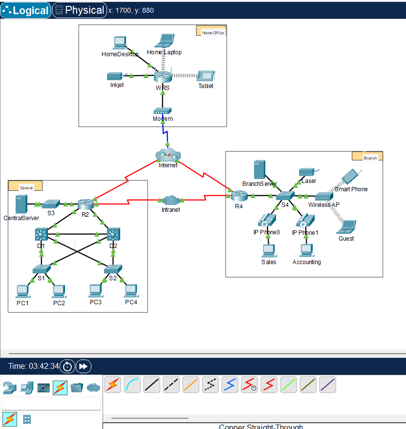
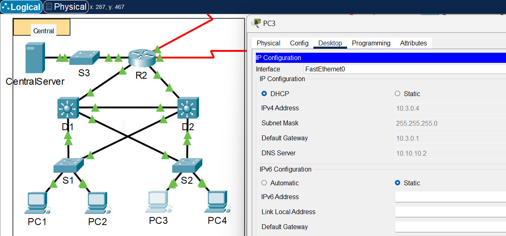
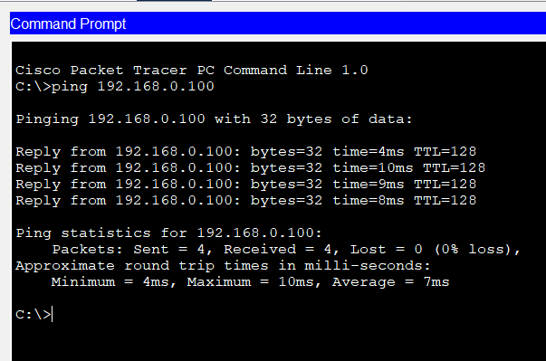

# Packet Tracer Lab Template
## Lab Title
Network Representation

## Student Name
Aida Ochoa

## Date Completed
2025-08-15

---

## Lab Summary

_Provide a brief summary of what the lab was about. What was the goal or objective?_
The intermediary devices on packet tracer are the routers, switches, hubs, wireless devices, security, and WAN emulation.
Home computers, laptops, printers, smartphones, tablets were endpoints on the topology.
The devices with multiple connections were the switches, the routers, the hubs, wireless devices, security, and WAN emulation.
The endpoint devices that were not desktop computers? - 4
The media devices used to connect these devices include; cable straight through, wireless router, and coaxial cables.
The client-server role can be explained by how you use your smartphone to search something up on the internet which is the server. The server then processes what you searched and sends back a response.
Two main functions of intermediary deviceslike a router can be used to connecting end devices to a network, maintaing signal. Security is an important function used to examine network traffic and block unauthorized access.
Two criterias for choosing a network media type are distance, to know about how long the signal can travel with minimal interference. For me, I would really care about the installation process, if it was simple and not too complex.
LAN stands for Local Area Network, local meaning nearby in smaller areas, like homes and small offices. Using the local WiFi you installed. WAN stands for Wide Area Network, which can span among cities, and countries. We use it everyday, the internet.
In this topology, I see 2 routers and 1 wireless router used as LANs. Internet and intranet are WANs.
The internet is a global network that connects us with millions of other users from all around the world.
The most common way to connect to the internet is through WiFi connection, from home or work.
Bigger organizations would probably use DSL, cable or fiber for a more fixed connection which offers more reliability.

---

## Reflection Questions

### 1. What did you do in this lab?
_Describe the steps you took and the tasks you completed._
- I studied my packet tracer topology for this lab, using the internet to research some details relating the questions on the lab. 

### 2. What did you learn?
_Explain the concepts or skills you gained from this lab._
- A refresher is always nice, to relearn some of the basic things we learned a few months back that we may have forgotten, for example the type of cables used.

### 3. What did you struggle with or not fully understand?
_Identify any parts of the lab that were confusing or challenging._
I realized, I had forgotten the type of cables that are used to connect devies to a local or wide area network. Going over those again was fun.

### 4. What suggestions do you have to improve this lab experience?
_Offer feedback on how the lab could be clearer, more engaging, or better supported._
I truly believe these are good labs, I am relearning in a different way and the way these labs are submitted has also been interesting to learn.

---

## Lab Completion Evidence

### 📸 Screenshot: Final Topology
_Insert screenshot showing the completed network topology_

### 📸 Screenshot: Device Configurations
_Insert screenshot(s) showing key device configurations (e.g., IP addressing, routing tables, VLANs)_

### 📸 Screenshot: Simulation Results
_Insert screenshot showing successful pings, traceroutes, or other simulation results_

---

## Submission Instructions

- Fork the lab repo
- Add your answers and screenshots
- Commit with message: `Completed Packet Tracer Lab`
- Push and submit your repo link in the assignment box

---

© 2025 Sean Ross. Template for educational use.
 