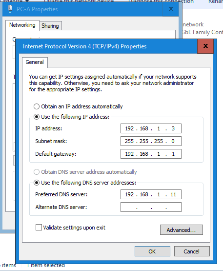
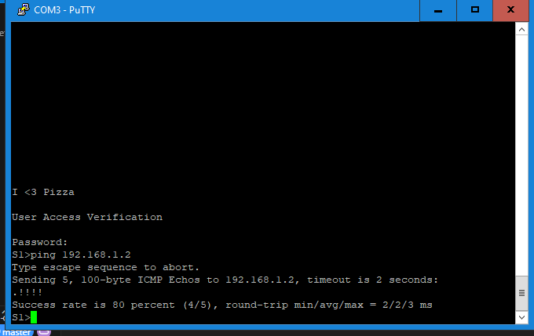

# 7.2.7 Lab - View Network Device MAC Addresses

## Topology & Addressing Table

| Device | Interface | IP Address     | Subnet Mask     | Default Gateway |
|--------|-----------|----------------|------------------|------------------|
| S1     | VLAN 1    | 192.168.1.2    | 255.255.255.0    | N/A              |
| PC-A   | NIC       | 192.168.1.3    | 255.255.255.0    | 192.168.1.1      |

---

## Objectives

- **Part 1:** Configure Devices and Verify Connectivity  
- **Part 2:** Display, Describe, and Analyze Ethernet MAC Addresses

---

## Part 1: Configure Devices and Verify Connectivity

### Step 1: Cable the network as shown in the topology

**Screenshot Placeholder:**  
`!Network Topology`

### Step 2: Configure the IPv4 address for the PC

- **Were the pings successful? Explain.**  
  _Answer:_  The ping had an 80% success rate
  

---

### Step 3: Configure basic settings for the switch

**Screenshot Placeholder:**  
`

1. **What is the OUI portion of the MAC address for this device?**  
   _Answer:_  00-E0-4C

2. **What is the serial number portion of the MAC address for this device?**  
   _Answer:_  68-07-85

3. **Using the example above, find the name of the vendor that manufactured this NIC.**  
   _Answer:_  Using the first half of the MAC address 00-E0-41, the manufacturer is REALTEK SEMICONDUCTOR CORP.

4. **Identify the OUI portion of the MAC address for the NIC of PC-A.**  
   _Answer:_  00-E0-4C

5. **Identify the serial number portion of the MAC address for the NIC of PC-A.**  
   _Answer:_  68-02-CB

6. **Identify the name of the vendor that manufactured the NIC of PC-A.**  
   _Answer:_  Using the first half of the MAC address 00-E0-41, the manufacturer is REALTEK SEMICONDUCTOR CORP.

---

### Step 6: Analyze the MAC address for the S1 VLAN 1 interface

1. **What is the MAC address for VLAN 1 on S1?**  
   _Answer:_  dc05.398c.f3c0

2. **What is the MAC serial number for VLAN 1?**  
   _Answer:_  8c.f3.c0

3. **What does BIA stand for?**  
   _Answer:_  BIA means Burned In Address, also meaning physical address

4. **Why does the output show the same MAC address twice?**  
   _Answer:_  This can be because a device can have multiple NICs and each can have its unique MAC address.

---

### Step 7: View the MAC addresses on the switch

1. **What Layer 2 addresses are displayed on S1?**  
   _Answer:_ Layer two address is dc05.398c.f3c0 

2. **What Layer 3 addresses are displayed on S1?**  
   _Answer:_  Layer three address is 192.168.1.5

3. **Did the switch display the MAC address of PC-A? If yes, what port was it on?**  
   _Answer:_  No, it did not show anything on PC-A. Besides CPU ports there were Gil/0/23, Gil/0/1, and Gil/0/23

---

## Reflection Questions

1. **Can you have broadcasts at the Layer 2 level? If so, what would the MAC address be?**  
   _Answer:_  Yes, you can have broadcasts at the level 2 layer. The MAC address used is FF:FF:FF:FF:FF:FF. This sends to every device on the local network.

2. **Why would you need to know the MAC address of a device?**  
   _Answer:_  For several reasons, to manage devices, for security, and to know what network needs troubleshooting.
