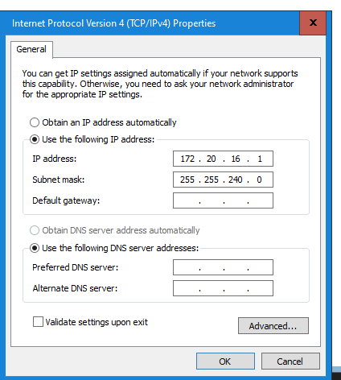
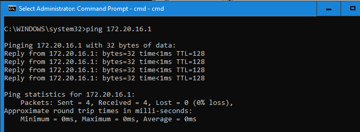

# 🧪 Lab: Investigating the ARP Table and Protocol 
Aida Ochoa
08/26/25

## 🧭 Objective

This lab will guide you through:
- Viewing and understanding the ARP table on a Windows machine.
- Selecting a target device on your home network.
- Clearing the ARP cache.
- Capturing ARP traffic using Wireshark.

---

## 🛠️ Prerequisites

- A Windows PC with administrative privileges.
- Wireshark installed.
- At least one other device connected to the same local network.
- Basic understanding of networking concepts (Layer 2, MAC addresses, IP addresses).

---

## 🔍 Step 1: View the ARP Table
1. Open **Command Prompt** as Administrator.
2. Run the following command:

   ```cmd
   arp -a
   ```
3. Observe the output. You should see a list of IP addresses and their corresponding MAC addresses.


## 🎯 Step 2: Identify a Target Device
1. Choose another device on your network (e.g., phone, tablet, another PC).
2. Find its IP address:
    - On Windows: open CMD and run `ipconfig` 
    - On MAC or Linux: open terminal and run `ip a`
    - On iOS or Android: check Wi-Fi settings 
3. Ping the device from your Windows machine:
    ```CMD
    ping <target IP>
    ```
4. Run the `arp -a` command again to confirm the target device appears in the ARP table





## 🧪 Step 3: Capture ARP Traffic with Wireshark

1. Open Wireshark and start capturing on your active network interface.
2. In the Display Filter, enter: `arp` 
3. Clear the entire ARP cache 
    ```CMD
    netsh interface ip delete arpcache 
    ```
4. Ping target device again 
    ```CMD
    ping <target IP>
    ```
5. Observe ARP request and reply packets in Wireshark 


***

## 🧠 Reflection Questions
1. What does the ARP table tell you about your local network?
An ARP table tells us which IP address have communicated with which MAC address. Which IP address is trying to communicate with which MAC address. Only the matching pairs receive a response and the ARP table stores this data for future use. It shows us what devices are on our network.
2. Why might an ARP entry be missing?
An ARP table could be missing due to the device not having made any connections yet and there is nothing to display. An ARP table will only show any sent or received local network traffic or if there is no internet for the device to communicate to.
3. What happens when you clear the ARP cache?
Clearing the ARP table cache will delete any connections it has made thus far and will have to reconnect the IP addresses and the MAC addresses all over again. Which is no problem but it could take longer since those connections were lost.
4. How does Wireshark help visualize Layer 2 communication?
Wireshark helps us visualize these connections being made in real time, we can see which MAC address is trying to communicate with which MAC address, the sender and the target. Which protocol type, hardware type and size it is.