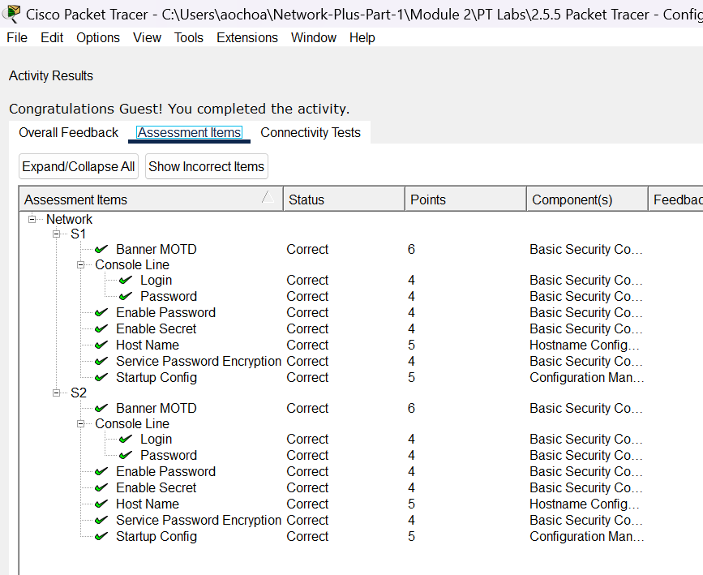

# Packet Tracer Lab Template
## Lab Title
Configure Initial Switch Settings

## Student Name
Aida Ochoa

## Date Completed
2025-08-22

---

## Lab Summary

_Provide a brief summary of what the lab was about. What was the goal or objective?_
In this Packet Tracer lab, I had to configure the Switch 1 settings. I enabled a basic password, then I set a more complex password (c1$c0) then i enabled the secret passwordand encrypted it so that when i display the contents it is not actually shown. I moved on and did the same steps with Switch 2.

---

## Reflection Questions

### 1. What did you do in this lab?
_Describe the steps you took and the tasks you completed._
I followed step by step on how to set a password after enabling the command line and changing the hostname to either S1 or S2. I enabled a "letmein" password. Then saved it and exited, entered back in with the password then changed it again to something more complex "c1$c0". Saved and exited. Once I re-entered, I enabled a secret password "itsasecret". After saving it with the command "copy running-config startup-config" I then went in to encrypt it by configuring "service password-encryption". I forgot to mention that on both switched I enabled a motd banner "This is a secure system. Authorized Access Only!"

### 2. What did you learn?
_Explain the concepts or skills you gained from this lab._
I learned how to configure a password and how to encrypt it.

### 3. What did you struggle with or not fully understand?
_Identify any parts of the lab that were confusing or challenging._
I didn't quite undersatand what the command "copy running-config startup-config" actually did. I did learn that that command actually saved everything.

### 4. What suggestions do you have to improve this lab experience?
_Offer feedback on how the lab could be clearer, more engaging, or better supported._
I enjoy these Packet Tracer labs, they allow me to practice with ease knowing I won't actually mess anything up.

---

## Lab Completion Evidence

### 📸 Screenshot: Final Topology
_Insert screenshot showing the completed network topology_

---

## Submission Instructions

- Fork the lab repo
- Add your answers and screenshots
- Commit with message: `Completed Packet Tracer Lab`
- Push and submit your repo link in the assignment box

---

© 2025 Sean Ross. Template for educational use.
 