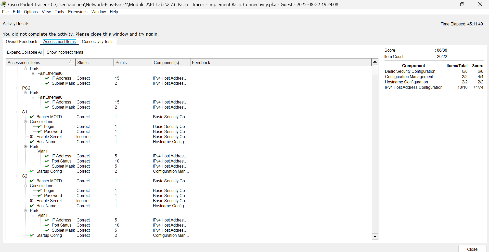
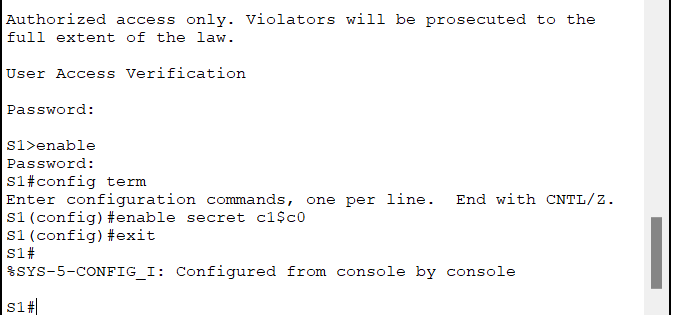

# Packet Tracer Lab Template
## Lab Title
Implement Basic Connectivity

## Student Name
Aida Ochoa

## Date Completed
2025-08-22

---

## Lab Summary

For this Packet tracer lab, I was tasked to configure basic configurations on the switches and set up the PCs with the IP addresses provided. After everything was configured, I then pinged all the devices to make sure they were successful.

---

## Reflection Questions

### 1. What did you do in this lab?
I set up Switch 1 and Switch 2 by changing their hostnames. Changed the passwords and ATTEMTED to enable the secret password. I also set up the motd on both devices and made sure to save the changes.

### 2. What did you learn?
I am starting to gain more knowledge and understanding of these command lines.

### 3. What did you struggle with or not fully understand?
I struggled with enabling the secret password. I got to the point where i could input it and even save it but it would not stay. I could not figure out what I was doing wrong. I clearly need more practice.

### 4. What suggestions do you have to improve this lab experience?
Honestly, if I had a cheat sheet with the commands it would be a lot easier. But then I remember what you said, and struggling and looking up my questions is part of the learning process. Besides that, these assignments are very good practice.
---

## Lab Completion Evidence

### 📸 Screenshot: Final Topology
_Insert screenshot showing the completed network topology_

### 📸 Screenshot: Device Configurations
_Insert screenshot(s) showing key device configurations (e.g., IP addressing, routing tables, VLANs)_

---

## Submission Instructions

- Fork the lab repo
- Add your answers and screenshots
- Commit with message: `Completed Packet Tracer Lab`
- Push and submit your repo link in the assignment box

---

© 2025 Sean Ross. Template for educational use.
 